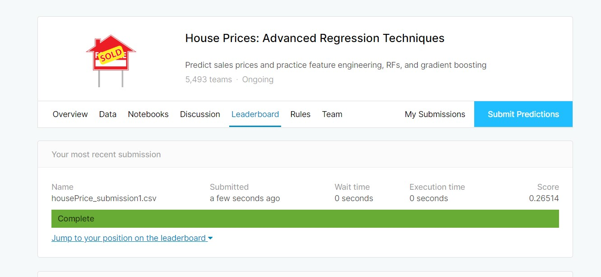
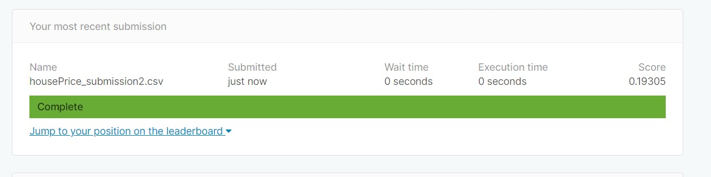

## Overview
The aim of the project is to develop a predictive model that predicts final price of homes?
This project is a submission for Kaggle House prices compeition to demostrate my knowledge of R having completed the HarvardX - Data science course. 

Ask a home buyer to describe their dream house, and they probably won't begin with the height of the basement ceiling or the proximity to an east-west railroad. But this playground competition's dataset proves that much more influences price negotiations than the number of bedrooms or a white-picket fence.
With 79 explanatory variables describing (almost) every aspect of residential homes in Ames, Iowa, the aim of this project is to predict the final price of each home.

The Ames Housing dataset was compiled by Dean De Cock for use in data science education. It's an incredible alternative for data scientists looking for a modernized and expanded version of the often cited Boston Housing dataset. 


## Goal and Metrics of the project
The objective of this project is to predict the sales price for each house. For each Id in the test set, the value of the SalePrice variable must be predicted. 
The predicted value is evaluated using Root-Mean-Squared-Error (RMSE) between the logarithm of the predicted value and the logarithm of the observed sales price.


## Introduction to Dataset
The dataset focuses on the quality and quantity of many physical attributes of a property that home owners are interested in. The dataset is divided into two, the train set and test set. The trainset is used for exploration while the test set is used for performance eveluation of the selected moodel. We will start by loading the data and relevant library.

```{r}
#load the libraries required for the project, if not exist then download
#load the required packages, if not available then download
if(!require(tidyverse)) install.packages("tidyverse", repos = "http://cran.us.r-project.org")
if(!require(caret)) install.packages("caret", repos = "http://cran.us.r-project.org")
if(!require(dplyr)) install.packages("tidyverse", repos = "http://cran.us.r-project.org")
if(!require(ggplot2)) install.packages("caret", repos = "http://cran.us.r-project.org")
if(!require(data.table)) install.packages("data.table", repos = "http://cran.us.r-project.org")
if(!require(randomForest)) install.packages("randomForest", repos = "http://cran.us.r-project.org")
if(!require(Boruta)) install.packages("Boruta", repos = "http://cran.us.r-project.org")
if(!require(rpart)) install.packages("rpart", repos = "http://cran.us.r-project.org")
#read the data
train_set <- read.csv("https://projects.smartsolutaris.com/train.csv", stringsAsFactors=FALSE)
test_set <- read.csv("https://projects.smartsolutaris.com/test.csv", stringsAsFactors=FALSE)
```

Then, evaluating the dimensions of the train set and test set
```{r}
dim(train_set)
dim(test_set)
#train_set is a data frame
class(train_set)

```
We need to understand the structure of the dataset, this will allow us gain insight into the data. To gain insight the keyword str is used to define the structure and type of each column. The column definition and data dictionary can be found here => https://projects.smartsolutaris.com/data_description.txt

```{r}
#we need to understand the structure of the dataset. To gain insight the keyword str is used.
str(train_set)
#description of factors can be found here 	https://projects.smartsolutaris.com/data_description.txt	
```
From the result above, we can notice that the dataset has missing value. In some cases, the NA represents that the feature doesnt exist. Thus the next step is cleaning the data.


## Exploratory Data Analysis and Feature Analysis
Here we check if there are missing values, skewed fields. Boruta Algorithm is used for Feature andlysis and handling of missing data


### Feature Analysis - Boruta: Wrapper Algorithm for All Relevant Feature Selection. 
Boruta is a feature selection algorithm. Precisely, it works as a wrapper algorithm around Random Forest. feature selection is a crucial step in predictive modeling. This technique achieves supreme importance when a data set comprised of several variables is given for model building.
This section determines what features may be relevant to predicting house sale price. 

```{r}
#Feature ANalysis and Data Cleanup
Identifier <- "Id"
Target <- "SalePrice"
# deterimine data types
Features <- setdiff(names(train_set),c(Identifier,Target))
Features_datatypes <- sapply(Features,function(x){class(train_set[[x]])})
table(Features_datatypes)

# categorize data types in the data set?
unique_classes <- unique(Features_datatypes)

attr_datatypes <- lapply(unique_classes,function(x){names(Features_datatypes[Features_datatypes==x])})
names(attr_datatypes) <- unique_classes

# pull out the response variable
response <- train_set$SalePrice

# missing values are handled as follows: * missing numeric data is set to -1 * missing character data is set to 0 since
for (x in attr_datatypes$integer){
  train_set[[x]][is.na(train_set[[x]])] <- -1
}

for (x in attr_datatypes$character){
  train_set[[x]][is.na(train_set[[x]])] <- 0
}

for (x in attr_datatypes$integer){
  test_set[[x]][is.na(test_set[[x]])] <- -1
}

for (x in attr_datatypes$character){
 test_set[[x]][is.na(test_set[[x]])] <- 0
}

# remove identifier and response variables
train_df <- train_set[Features]
 #use Boruta to compute important attributes for SalePrice prediction
set.seed(13)
bor.results <- Boruta(train_df,response,
                      maxRuns=101,
                      doTrace=0)
bor.results
#get the important attributes
getSelectedAttributes(bor.results)
plot(bor.results)
#From the result above, notice that 50 attributes are confirmed important.
attStats(bor.results)
comp_boruta <- arrange(cbind(attr=rownames(attStats(bor.results)), attStats(bor.results)),desc(medianImp))
confirmed_columns <- comp_boruta %>% filter(decision == "Confirmed") %>% select(attr)
removed_columns <- comp_boruta %>% filter(decision != "Confirmed") %>% select(attr)
```
Based on the result generated from Boruta Analysis, the 50 confirmed attributes as important will be used for model building
```{r}
#creating a confirmed dataset from Boruta Analysis to create the trainset
#creating a confirmed dataset from Boruta Analysis to create the trainset
final_trainset <- train_set %>% select(Id, GrLivArea,OverallQual,X2ndFlrSF,TotalBsmtSF,X1stFlrSF,GarageArea,
                                       GarageCars,YearBuilt,ExterQual,YearRemodAdd,GarageYrBlt,LotArea,
                                       FireplaceQu,FullBath,Fireplaces,MSSubClass,BsmtFinSF1,
                                       BsmtQual,TotRmsAbvGrd,GarageType,Neighborhood,HalfBath,GarageFinish,BldgType,
                                       Foundation,BedroomAbvGr,HouseStyle,OpenPorchSF,BsmtUnfSF,CentralAir,
                                       BsmtFinType1,MasVnrArea,GarageCond,GarageQual,KitchenAbvGr,OverallCond,
                                       BsmtCond,BsmtFullBath,PavedDrive,WoodDeckSF,
                                       LandContour,BsmtFinType2,Fence,SaleCondition,SalePrice)

final_testset <- test_set %>% select(Id, GrLivArea,OverallQual,X2ndFlrSF,TotalBsmtSF,X1stFlrSF,GarageArea,
                                     GarageCars,YearBuilt,ExterQual,YearRemodAdd,GarageYrBlt,LotArea,
                                     FireplaceQu,FullBath,Fireplaces,MSSubClass,BsmtFinSF1,
                                     BsmtQual,TotRmsAbvGrd,GarageType,Neighborhood,HalfBath,GarageFinish,BldgType,
                                     Foundation,BedroomAbvGr,HouseStyle,OpenPorchSF,BsmtUnfSF,CentralAir,
                                     BsmtFinType1,MasVnrArea,GarageCond,GarageQual,KitchenAbvGr,OverallCond,
                                     BsmtCond,BsmtFullBath,PavedDrive,WoodDeckSF,
                                     LandContour,BsmtFinType2,Fence,SaleCondition)
```


### Data Modelling

for cross validation purpose, there is need to divide the feature extracted train_set into training and validation.

```{r}
#for cross validation purpose, there is need to divide the train_set into training and validation.
#creating index for division
index <- createDataPartition(y = final_trainset$SalePrice, times = 1, p = 0.1, list = FALSE)
#using the index to split into training and validation
training <- final_trainset[-index,]
validation <- final_trainset[index,]

#Convert all character variable into factor in one line:
training <- training %>% mutate_if(is.character, as.factor)
validation <- validation %>% mutate_if(is.character, as.factor)

```

#### Evaluation of the Models
The predicted value is evaluated using Root-Mean-Squared-Error (RMSE) between the logarithm of the predicted value and the logarithm of the observed sales price.
```{r}
## Evaluation of predicted sale price

RMSE <- function(predicted_val, actual_value)
{
  log(predicted_val) - log(actual_value)
}
```

#### Training the models

##### KNN - K-Nearest Neighbour
```{r}
control <- trainControl(method = "cv", number = 10, p = .9)
train_knn <- train(SalePrice ~ ., method="knn", data = training, tuneGrid = data.frame(k = seq(1, 71, 2)),
                   trControl = control)
ggplot(train_knn)
train_knn$bestTune
knn_y_hat <- predict(train_knn, validation)

rmse_knn <- RMSE(knn_y_hat, validation$SalePrice)
mean(rmse_knn)
#creating a table to aggregate RMSE Models 
rmse_results <- tibble(method = "K-Nearest Neighbour", RMSE = mean(rmse_knn))
```

##### Random Forest
```{r}
control <- trainControl(method="cv", number = 5)
grid <- data.frame(mtry = c(1, 5, 10, 25, 50, 100))
train_rf <- train(SalePrice ~ .,
                  method = "rf",
                  data = training,
                  ntree = 150,
                  trControl = control,
                  tuneGrid = grid,
                  nSamp = 5000)
ggplot(train_rf)
train_rf$bestTune

rf_yhat <- predict(train_rf, validation, type = "raw")
rmse_rf <- RMSE(rf_yhat, validation$SalePrice)
mean(rmse_rf)
rmse_results<- bind_rows(rmse_results, tibble(method = "Random Forest", RMSE = mean(rmse_rf)))
```


##### Regression Tree
```{r}
train_rpart <- train(SalePrice ~., method="rpart", tuneGrid = data.frame(cp = seq(0, 0.05, len = 100)),
                     data = training)
plot(train_rpart)
rpart_yhat <- predict(train_rpart, validation)
rmse_rpart <- RMSE(rpart_yhat, validation$SalePrice)
mean(rmse_rpart)
rmse_results <- bind_rows(rmse_results, tibble(method = "Regression Tree", RMSE = mean(rmse_rpart)))
```

#### Ensemble Model

one can usually greatly improve the final results by combining the results of different algorithms.we compute new class probabilities by taking the average of random forest, regression tree and kNN
```{r}
p <- (knn_y_hat +rpart_yhat + rf_yhat)/3
rmse_em <- RMSE(p, validation$SalePrice)
rmse_results<- bind_rows(rmse_results, tibble(method = "Ensemble", RMSE = mean(rmse_em)))
mean(rmse_em)
rmse_results %>% knitr::kable()
```


## Performance Analysis and Result
 
From the result above, the KNN method and Regression Tree will be used to train the full train dataset and the result used to predict SalePrice for test dataset.
```{r}
#train the full test dataset using KNN

control <- trainControl(method = "cv", number = 10, p = .9)
train_final<- train(SalePrice ~ ., method="knn", data = final_trainset, tuneGrid = data.frame(k = seq(1, 71, 2)),
                   trControl = control)


#Prepare the prediction data
prediction <- predict(train_final, final_testset)
#Bind the result to the test dataset
output <- cbind(final_testset, prediction)
#prepare the final prediction result for Submission File Format
final_prep <- data.frame(Id= output$Id, SalePrice = output$prediction)

#Write the fianl result to a text file
write.csv(final_prep, file = "housePrice_submission1.csv", row.names = F)

#train the full test dataset using regression tree
final_rpart <- train(SalePrice ~., method="rpart", tuneGrid = data.frame(cp = seq(0, 0.05, len = 100)),
                     data = final_trainset)

#Prepare the prediction data
prediction_rpart <- predict(final_rpart, final_testset)
#Bind the result to the test dataset
output <- cbind(final_testset, prediction_rpart)
#prepare the final prediction result for Submission File Format
final_prep <- data.frame(Id= output$Id, SalePrice = output$prediction_rpart)

#Write the fianl result to a text file
write.csv(final_prep, file = "housePrice_submission2.csv", row.names = F)
```

## Conclusion
Upon calculation the RMSE of the predicted value for KNN is 0.26514 while RPart is 0.19305.
the image below shows the Kaggle computed result for KNN


the image below shows the Kaggle computed result for Regression Tree


The result implies that Regression Tree has a better prediction with low RMSE. Thus the prediction model can be improved since the RMSE target is zero.

